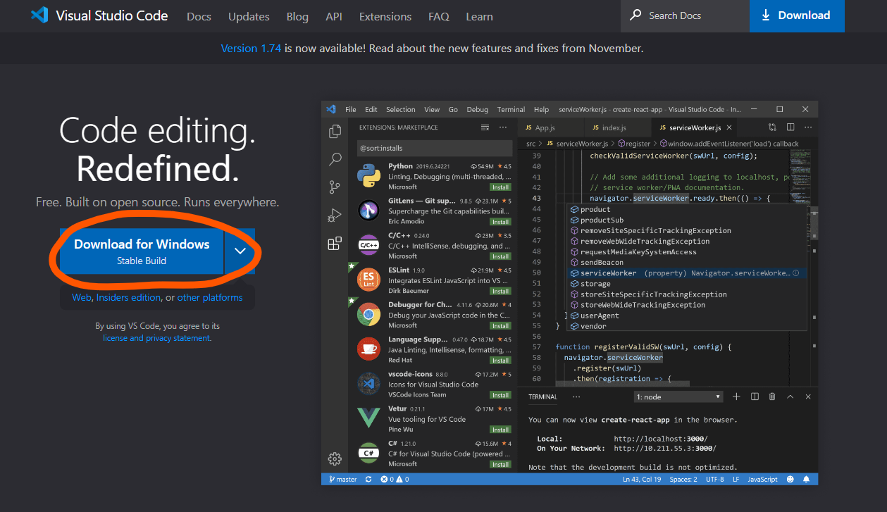
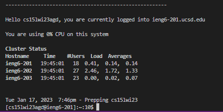
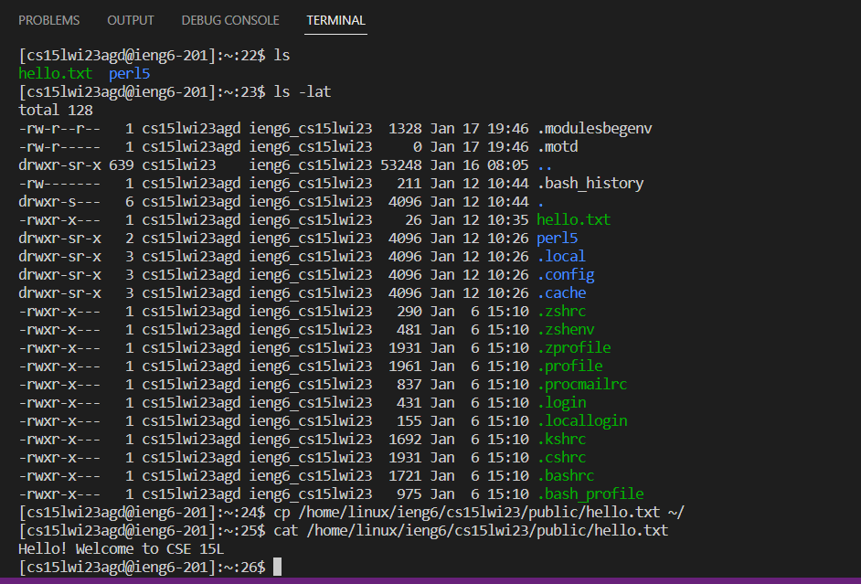

# Week 1 (2023-01-12) - Remote Access

---

Whether you're my future self, another hypothetical 15L student who somehow found this page, or the person grading this page as an assignment, you may be looking at this page for a tutorial on how to log into an ieng6 account. There are three steps to this: installing VSCode, remotely connecting, and trying out commands, so let's get into it.

# Installing VSCode

To install VSCode, go to [this site](https://code.visualstudio.com/) and download the right version depending on your operating system. Once the file is done downloading, run it (either by clicking on it in File Explorer/your File Explorer equivalent or using the bottom bar that pops up in your browser) and accept any agreements that the installer brings up. Click next until VSCode starts to install, though when you reach the "Select Destination Location" step, make sure that it's installing into the right directory that you want it to be at.

> NOTE: You may eventually reach a step where the installation wizard asks if you want to Add "Open with Code" action to Windows Explorer file context menu/Windows Explorer directory context menu. CHECK THAT OPTION. It will let you open projects by right clicking on the files in your system.

Once it's finished installing, add any other extensions you may want for your purpose. Extensions and themes can be found in the sidebar under the magnifying glass icon. Personally, I didn't complete these steps because I already had VSCode installed with all the necessary extensions that I wanted.

# Remotely Connecting

Great! You now have VSCode. To remotely connect to a lab computer, open a new terminal window using the Terminal > New Terminal option in the top bar of the window. Type in `ssh cs15lwi23$$$@ieng6.ucsd.edu` into the terminal, with the $$$ being replaced with your course specific account numbers (mine is/was `agd`). If this is your first time, you may be given a `yes/no` prompt; just respond `yes`. Now, you should type in your password to the account; don't sweat it if it takes a few times, the system is finicky like that (read: my clumsy fingers didn't get it right the first 20 tries). 

> NOTE: The password may not be showing for you in Terminal, and that's okay, because it's a password. It'll be hidden, just like when websites hide your passwords with a bunch of dots or \*\*\*\*\*\*\*\*\*\*\*\*.

Now that you've made it in, congrats! You should see something like this printed to Terminal:

# Trying Some Commands

Alright, let's test out some commands. Remember the meaning of different commands in Terminal: 

* `cd` means "change directory" and lets you enter or exit directories with a path 
* `ls` means "list" and shows you files and folders in the current location
* `mkdir` creates a directory (makes a folder).
* `cp` lets you copy files and directories
* `cat` is short for concatenate and lets you print a text file's contents, among other things

Additionally, when it comes to paths:

* `~` refers to your home directory
* `..` means to take a step back into the parent of your current directory

# Closing Remarks

Remoting into a computer is a pretty common practice and is pretty helpful to know about, especially during a time when remote work is becoming more and more popular (at the time of writing this). Chances are, you'll have to do it at some point in your career, so it's just a nice thing to know. Hopefully this tutorial was helpful, and if any particular situations or issues pop up, it may be helpful to look at documentation just to make sure you don't run `rm -rf /` on your system.

Maybe you might though, just for fun. Try it, who knows what will happen?
