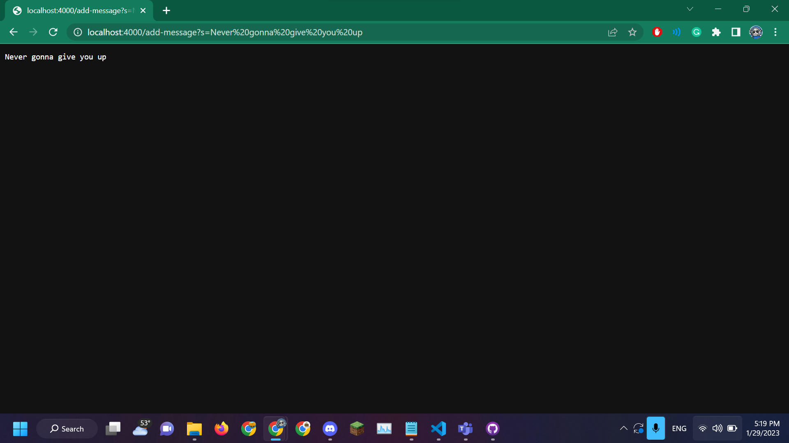
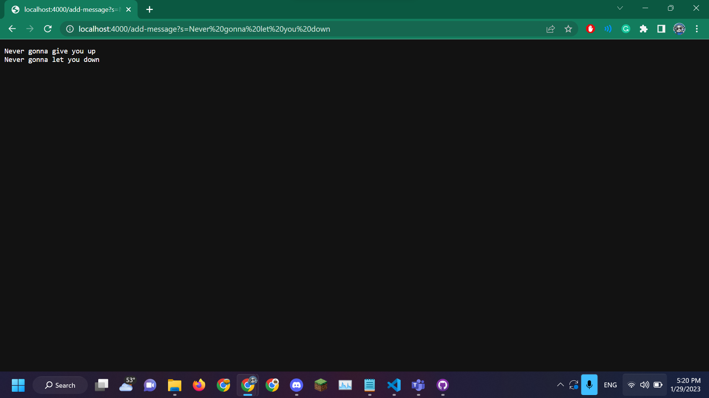
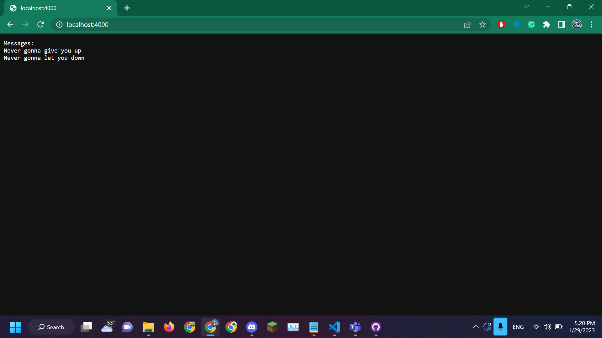
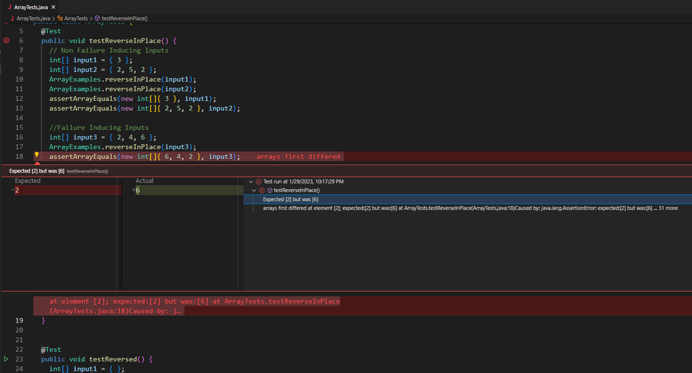

# Week 3 (2023-01-26) - Servers and Bugs
---


Something I forgot to mention last time: these pages will be updated biweekly over the course of a 10 week quarter as per UCSD's quarter system. That's why you might see the title of some of these pages skipping weeks, like "Week 1", "Week 3", etc.

In any case, this week we're going over creating web servers and fixing bugs, so let's get into it.

# Writing a Web Server

For the task of writing a web server, I created this file called `StringServer.java` and compiled it along with another file called `Server.java`. My code for `StringServer.java` was based off of Week 2's lab, particularly from the files in Professor Joe Politz's [wavelet repository](https://github.com/ucsd-cse15l-f22/wavelet).
```
// Creates web server that tracks string input made through queries in the URL
// Sources: CSE 15L Lab 2, wavelet by Prof. Joe Politz: 
// https://github.com/ucsd-cse15l-f22/wavelet

import java.io.IOException;
import java.net.URI;

class Handler implements URLHandler {
    // A string that wil be manipulated by server requests.
    StringBuilder msg = new StringBuilder();

    public String handleRequest(URI url) {
        if (url.getPath().equals("/")) {
            return String.format("Messages: \n%s", msg);
        } else {
            System.out.println("Path: " + url.getPath());
            if (url.getPath().contains("/add-message")) {
                String[] parameters = url.getQuery().split("=");
                if (parameters[0].equals("s")) {
                    if (msg.isEmpty()) {
                        msg.append(parameters[1].toString());
                        return String.format(msg.toString());
                    } else {
                        msg.append("\n" + parameters[1].toString());
                        return String.format(msg.toString());
                    }
                }
            }
            return "404 Not Found!";
        }
    }
}

class StringServer {
    public static void main(String[] args) throws IOException {
        if(args.length == 0){
            System.out.println("Missing port number! Try any number between 1024 to 49151");
            return;
        }

        int port = Integer.parseInt(args[0]);

        Server.start(port, new Handler());
    }
}
```

There's only about 46 lines to `StringServer.java`. So what does it do?

`StringServer.java` displays strings placed in a formatted query in the URL on the page. 

For example:

## Scenario 1


## Scenario 2



It also displays these messages on the home page, too:



When starting the server, the main method runs; first, it checks that the argument made while starting the process is an open port. If not, it prints a message to console. Otherwise, it parses the port as an integer and starts the server on that port.

Once the server is running, the `handleRequest()` method is called, which takes an argument of a URI object called `url`. Then, the method checks for the path. If the path amounts to `/`, the method returns a list of all messages formatted under a line that reads `Messages:`.

In the case of the above scenarios where a query is passed into the URL with the format `/add-message?s=<String to be added>`, the function then verifies that the URL does contain `/add-message` before splitting the path's query with `=` as a delimiter. This split value is saved to an array of strings known as `parameters`.

If the 0 index of `parameters` equals `s`, the method then checks for if a Stringbuilder variable called `msg` is empty. From this point on, the scenarios diverge:
* For Scenario 1, since `msg` was empty, `handlerequest()` appends the 1st index of `parameters` to `msg`
* For Scenario 2, since `msg` already held a string, `handlerequest()` appends the 1st index of `parameters` to `msg` after prepending the `\n` character to it

Following this, what happens is the same for either scenario: the site then displays the entirety of `msg` after the string query in the URL has been added.

Throughout this entire process, there are three fields whose values consistently change:
* Stringbuilder `msg`, which constantly saves new strings from queries made in the URL
* String[] `parameters`, which results from splitting the query in the URL
* URI `url`, the argument for the `handleRequest()` method, which changes with new queries made but can also not contain the path `/add-message` at all

# Debugging for Lab 3

Lab 3 had a particular focus on debugging. One of bugs that I found interesting from that lab was in a file that centered around modifying arrays, particularly a method that would reverse the array's value called `reverseInPlace()`, which took the integer array to be reversed as an argument. During the lab, we were given the opportunity to use JUnit to write some test cases that would help with debugging the method. Here are some of them:

## Non-failure Inducing Inputs
```
int[] input1 = { 3 };
int[] input2 = { 2, 5, 2 };
ArrayExamples.reverseInPlace(input1);
ArrayExamples.reverseInPlace(input2);
assertArrayEquals(new int[]{ 3 }, input1);
assertArrayEquals(new int[]{ 2, 5, 2 }, input2);
```

## Failure Inducing Inputs
```
int[] input3 = { 2, 4, 6 };
ArrayExamples.reverseInPlace(input3);
assertArrayEquals(new int[]{ 6, 4, 2 }, input3);
```

> Note: All of the above were contained in a tester method in a seperate file called `testReverseInPlace()`.

Of course, running the failure test case from above caused an issue, as seen below: 



Instead of the expected number at index 2, which was 6, the array encountered the number 2 instead. Now, why is that? Take a look at the `reverseInPlace()` method and see if you can figure it out:


## Before Fixing the Bug
```
static void reverseInPlace(int[] arr) {
    for(int i = 0; i < arr.length; i += 1) {
      arr[i] = arr[arr.length - i - 1];
    }
}
```

At a quick glance, it looks like the code is doing what it's meant to do: it's iterating through the array from start to finish and reassigning values from the end to the beginning. If we trace the code to further understand the problem, we realize that once `i` from the for loop passes the halfway mark in `arr.length`, the loop starts referencing values that have already been rewritten in order to finish the array. That means that every time, around half of the array is incorrectly reversed because the loop no longer has an accurate reference point, like if you tried to copy a manuscript but someone patched in the second half with the first half reversed once you got halfway.

So how can we fix this?

## After Fixing the Bug
```
static void reverseInPlace(int[] arr) {
    int[] temp = new int[arr.length];
    for (int i = 0; i < arr.length; i++) {
      temp[i] = arr[i];
    }
    for(int i = 0; i < arr.length; i += 1) {
      arr[i] = temp[arr.length - i - 1];
    }
}
```

By making a deep copy (`temp`) of the array that we're reversing, we can avoid all the issues that come with directly editing the array while referencing it. Because this deep copy doesn't change, we can use it to rewrite the original array with ease without having to worry about overwriting important data. When writing loops to reverse or otherwise modify array data, this mistake can be pretty common. In my first CSE class at UCSD, I had to contend with a Stepik problem that had a very similar bugged code question and spent a solid hour trying to figure out what was wrong with it. These kinds of problems emphasize the importance of tracing your code to find flaws in your logic.

# Closing Remarks: What Have We Learned?

There's been a lot to learn over these past 2 weeks, what with Labs 2 & 3. For example, I now know how to create a web server from Java that provides responses to queries in the URL, and how to distinguish between flawed methods that cause JUnit to throw errors vs. flawed JUnit test cases that don't reflect the functionality of Java or the method it's testing. However, one of the biggest things that stood out to me was from Lab 2 with trying to run a web server off of the remote computers. It was confusing trying to figure out how to test the programs without access to `localhost` until I spoke with my group and realized that we had to use the names of the computers in the URLs (for example: ieng6-420.ucsd.edu:INSERT_PORT_NUMBER_HERE). Though the scope of what we did in Lab 2 was pretty small, I think I have a greater interest in learning about networking now.
