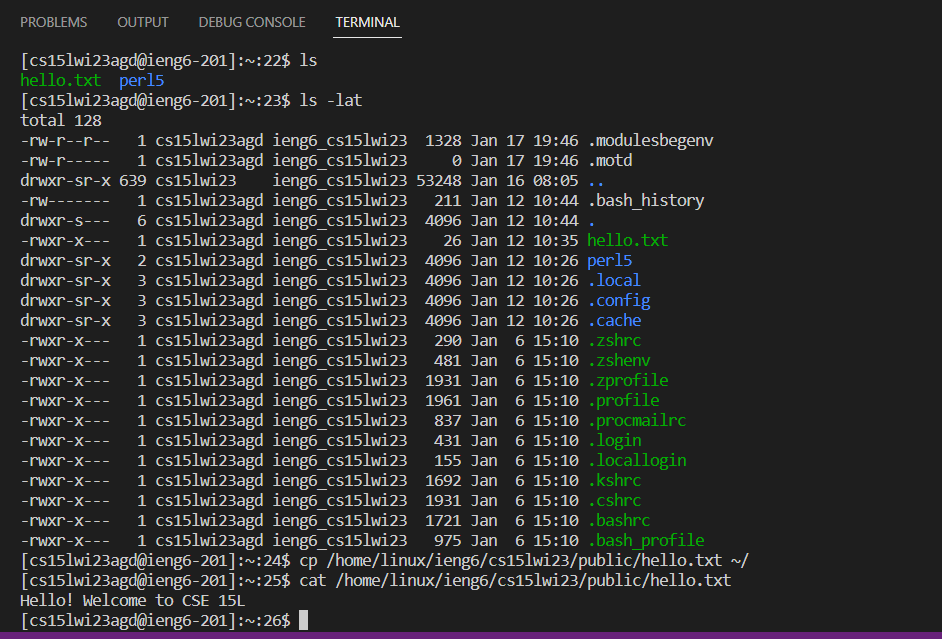

# Week 3 (2023-01-26) - Servers and Bugs
---


Something I forgot to mention last time: these pages will be updated biweekly over the course of a 10 week quarter as per UCSD's quarter system. That's why you might see the title of some of these pages skipping weeks, like "Week 1", "Week 3", and such.

In any case, this week, we're going over creating web servers and fixing bugs, so let's get into it.

# Writing a Web Server

For the task of writing a web server, I created this file called `StringServer.java` and compiled it along with another file called `Server.java`. My code for `StringServer.java` was based off of Week 2's lab, particularly in Professor Joe Politz's [wavelet repository]([https://code.visualstudio.com/](https://github.com/ucsd-cse15l-f22/wavelet)).
```
// Creates web server that tracks string input made through queries in the URL
// Sources: CSE 15L Lab 2, wavelet by Prof. Joe Politz: 
// https://github.com/ucsd-cse15l-f22/wavelet

import java.io.IOException;
import java.net.URI;

class Handler implements URLHandler {
    // A string that wil be manipulated by server requests.
    StringBuilder msg = new StringBuilder();

    public String handleRequest(URI url) {
        if (url.getPath().equals("/")) {
            return String.format("Messages: \n%s", msg);
        } else {
            System.out.println("Path: " + url.getPath());
            if (url.getPath().contains("/add-message")) {
                String[] parameters = url.getQuery().split("=");
                if (parameters[0].equals("s")) {
                    if (msg.isEmpty()) {
                        msg.append(parameters[1].toString());
                        return String.format(msg.toString());
                    } else {
                        msg.append("\n" + parameters[1].toString());
                        return String.format(msg.toString());
                    }
                }
            }
            return "404 Not Found!";
        }
    }
}

class StringServer {
    public static void main(String[] args) throws IOException {
        if(args.length == 0){
            System.out.println("Missing port number! Try any number between 1024 to 49151");
            return;
        }

        int port = Integer.parseInt(args[0]);

        Server.start(port, new Handler());
    }
}
```

There's only about 46 lines to `StringServer.java`, but essentially what is does is display strings placed in a formatted query in the URL on the page. For example:

Scenario 1


Scenario 2


It also displays these messages on the home page, too:


When starting the server, the main method runs; first, it checks that the argument made while starting the process is an open port. If not, it prints a message to console. Otherwise, it parses the port as an integer and starts the server on that port.

Once the server is running, the handleRequest method is called, which takes an argument of a URI object called `url`. Then, the method checks for the path. If the path amounts to `/`, the method returns a list of all messages formatted under a line that reads `Messages:`.

In the case of the above scenarios where a query is passed into the URL with the format `/add-message?s=<String to be added>`, the function then verifies that the URL does contain `/add-message` before splitting the path's query with `=` as a delimiter. This split value is saved to an array of strings known as `parameters`.

If the 0 index of `parameters` equals `s`, the method then checks for if a Stringbuilder variable called `msg` is empty. From this point on, the scenarios diverge:
* For Scenario 1, since `msg` was empty, handlerequest appends the 1st index of `parameters` to `msg`
* For Scenario 2, since `msg` already held a string, handlerequest appends the 1st index of `parameters` to `msg` after prepending the `\n` character to it

Following this, what happens is the same for either scenario: the site then displays the entirety of `msg` after the string query in the URL has been added.

Throughout this entire process, there are three fields whose values consistently change:
* Stringbuilder `msg`, which constantly saves new strings from queries made in the URL
* String[] `parameters`, which results from splitting the query in the URL
* URI `url`, the argument for the handleRequest method, which changes with new queries made but can also not contain the path `/add-message` at all

# Remotely Connecting

Great! You now have VSCode. To remotely connect to a lab computer, open a new terminal window using the Terminal > New Terminal option in the top bar of the window. Type in `ssh cs15lwi23$$$@ieng6.ucsd.edu` into the terminal, with the $$$ being replaced with your course specific account numbers (mine is/was `agd`). If this is your first time, you may be given a `yes/no` prompt; just respond `yes`. Now, you should type in your password to the account; don't sweat it if it takes a few times, the system is finicky like that (read: my clumsy fingers didn't get it right the first 20 tries). 

> NOTE: The password may not be showing for you in Terminal, and that's okay, because it's a password. It'll be hidden, just like when websites hide your passwords with a bunch of dots or \*\*\*\*\*\*\*\*\*\*\*\*.

Now that you've made it in, congrats! You should see something like this printed to Terminal:


# Trying Some Commands

Alright, let's test out some commands. Remember the meaning of different commands in Terminal: 

* `cd` means "change directory" and lets you enter or exit directories with a path 
* `ls` means "list" and shows you files and folders in the current location
* `mkdir` creates a directory (makes a folder).
* `cp` lets you copy files and directories
* `cat` is short for concatenate and lets you print a text file's contents, among other things

Additionally, when it comes to paths:

* `~` refers to your home directory
* `..` means to take a step back into the parent of your current directory



# Closing Remarks

Remoting into a computer is a pretty common practice and is helpful to know about, especially during a time when remote work is becoming more and more popular (at the time of writing this). Chances are, you'll have to do it at some point in your career, so it's just a nice thing to know. Hopefully this tutorial was helpful, and if any particular situations or issues pop up, it may be helpful to look at documentation just to make sure you don't run `rm -rf /` on your system.

Maybe you might though, just for fun. Try it, who knows what will happen?
