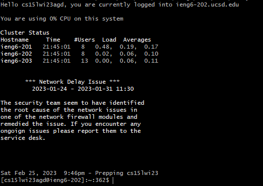
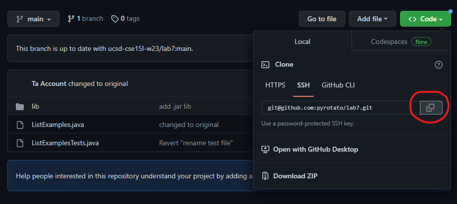
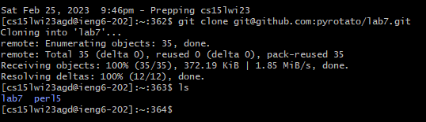
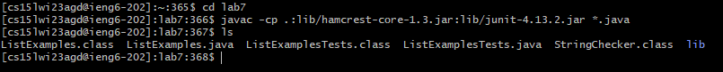
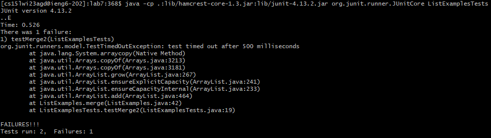
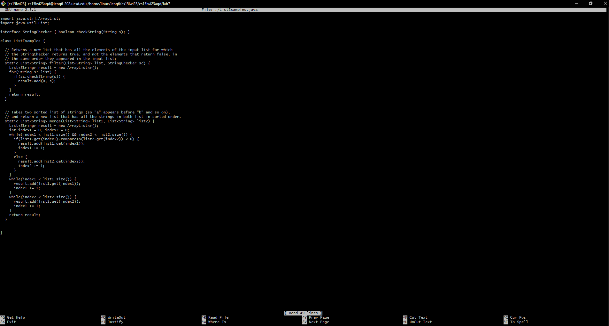
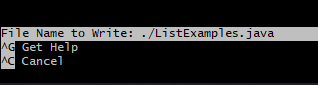
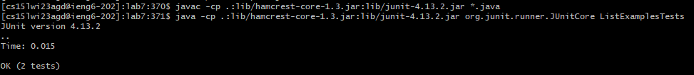
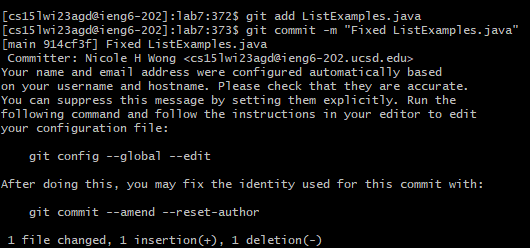
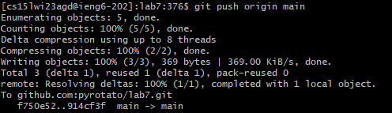

# Week 7 (2023-02-23) - JUnit on Speed

---


If you've ever used in-game commands in Minecraft, you'll know that you can use tab to autocomplete different parts of commands. At least, that's how I figured out that you could use tab to autocomplete a lot of things. Turns out, that also applies to terminal commands. In the Week 7 lab, we use tab autocomplete and Nano to test and edit a faulty Java file and commit the changes to a repo.

# Step 1: SSH into the lab computers



In order to remote into the UCSD lab computers, first we have to use the `ssh <name@host>` command. In order to access the computer, I used the username given to me from [Lab 1](https://pyrotato.github.io/cse15l-lab-reports/wk1-remote-access). Because I made and linked an SSH key, I was able to get by without typing my password for the login.

```
WHAT I TYPED:
=====
ssh cs15lwi23agd@ieng6.ucsd.edu
```

# Step 2: Cloning my fork of the Lab 7 repo



Then, we'll have to clone our fork of the Lab 7 repo in order to access and modify the files. To do this, first, we fork the repo. Then, we'll copy the SSH URL and use that to do our cloning.



Using the `git clone <repo url>` command will clone that repo to the current directory. Because I had the URL copied, I was able to paste it into the terminal 

```
WHAT I TYPED:
=====
git clone <shift insert>
```

# Step 3: Running the tests



After this, we enter the Lab 7 folder and compile all the .java files in there with a command copied from [Week 3's lab](https://ucsd-cse15l-w23.github.io/week/week3/), specifically the command for Mac users.



Following that, we'll use another command from Week 3's lab, `java -cp .:lib/hamcrest-core-1.3.jar:lib/junit-4.13.2.jar org.junit.runner.JUnitCore ArrayTests`, though we'll replace `ArrayTests` with the name of the Lab 7 testing file, `ListExamplesTests`.

```
WHAT I TYPED:
=====
<shift insert>
<shift insert><backspace x10>L<tab>T<tab><backspace>
```

> For the above example, x10 has been indicated that backspace was pressed 10 times to avoid repetition of <backspace> in the codeblock.

# Step 4: Fixing the file in Nano



After confirming that the JUnit tests ran and failed, we can edit the ListExamples file in the Nano editor with the `nano <filepath>` command.



Then, we can save with Ctrl + O and exit Nano with Ctrl + X.

```
WHAT I TYPED:
=====
nano L<tab>.j<tab>
<ctrl w>
index1 +=<enter>
<down x13><rightx4><backspace>
2
<ctrl o><enter>
<ctrl x>
```

# Step 5: Running the tests again



Now let's run the tests again. Instead of recompiling with copy pasting/typing again, we can use the up arrow to access previous commands.

```
WHAT I TYPED:
=====
<up x3><enter>
<up x3><enter>
```

# Step 6: Committing and pushing



Finally, we're going to add our changes and commit them with the `git add <filename>` and `git commit -m <message of commit>`.



Then, we can push with the command `git push <remote> <branch>`.

```
WHAT I TYPED:
=====
git add L<tab>.j<tab>
git commit -m "Fixed ListExamples.java"
git push <tab> main
```

# Closing Remarks

Overall, it was really interesting learning about how to commit and push from the bash terminal. I wasn't surprised that tab autocomplete also worked in terminal since it's such a common feature in other computer related services, though it was really nice to learn how tab interacted with certain parameters. This also means that if I ever want to not open Github Desktop for some reason, I can just edit a file, commit my changes, and push those changes for a forked repo directly from the terminal. Additionally, though I didn't use VIM this time, it was nice learning about how to use terminal editors to edit files. As someone who frequently uses tab, the arrow keys, and keyboard shortcuts to navigate sites instead of UI elements and mouse input, it didn't feel unfamiliar to me at all.