# Week 9 (2023-03-09) - How Did We Get Here?

---


As we ride off towards the horizon of the final(s) week, the next Skill Demo approaches fast. But before that, we have one last lab report: a reflection of our times in this class, and specifically for me, a redo of the grading script from PA6.

# Preparing The Environment

To get ready, first I delete any previous forks I previously made of [Lab 6's list-examples-grader repo](https://github.com/ucsd-cse15l-w23/list-examples-grader) and make another fork. Then, I open up GitHub Desktop and clone the fork by going to `File > Clone repository...`. After that, I open the folder by right clicking the name of the repo in the upper left and selecting "Open in VSCode".

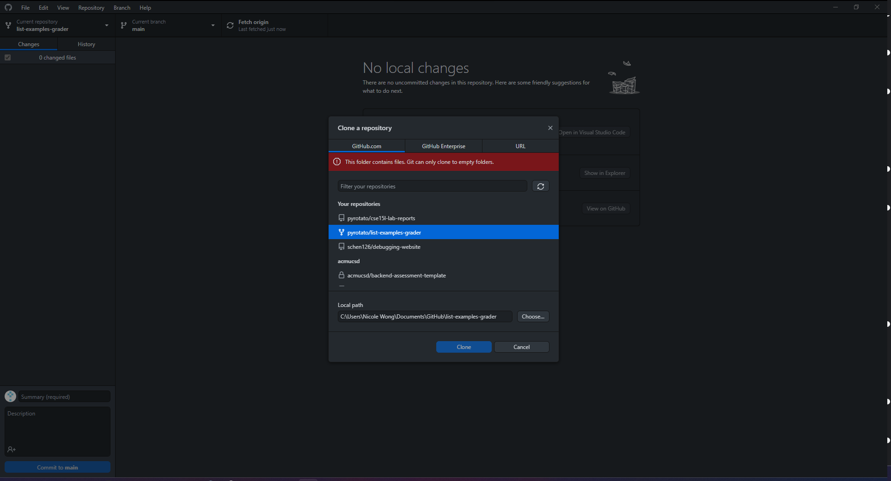
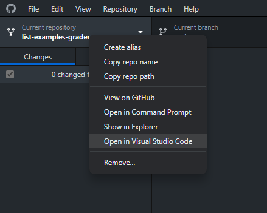

> NOTE: In the above screenshot, GitHub Desktop prints the message "This folder contains files. Git can only clone to empty folders." This is because at the time of taking the screenshot, I had already cloned that fork.

Once I've opened the folder, I can navigate to the `grade.sh` file to start working on the bash script.

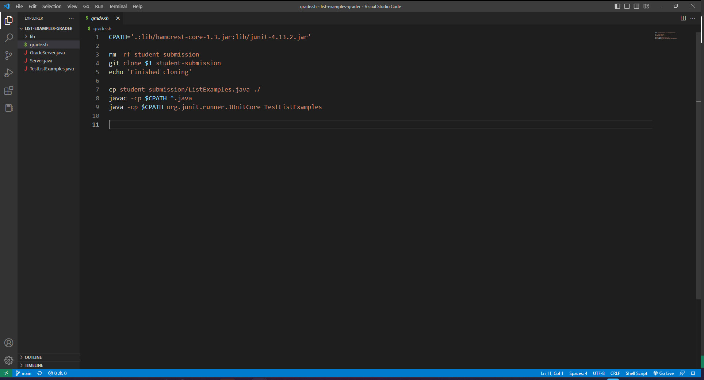

# Making Small Fixes To The Existing Code

```
CURRENT CODE IN grade.sh:

---

CPATH='.:lib/hamcrest-core-1.3.jar:lib/junit-4.13.2.jar'

rm -rf student-submission
git clone $1 student-submission
echo 'Finished cloning'

cp student-submission/ListExamples.java ./
javac -cp $CPATH *.java
java -cp $CPATH org.junit.runner.JUnitCore TestListExamples
```

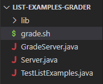

First things in order: a little housekeeping. I'm running Windows, so disregard if you're on Mac, but if you're part of Windows gang you may want to change that CPATH variable to something slightly different. I'm switching out all the colons (:) for semicolons(;). Additionally, if you look at the code, it's clear that whoever wrote this intended for us to clone the code to be graded into a folder in `student-submission` within the `list-examples-grader` folder. Because I intend to keep all `.java` files in that directory, let's also add `../` before both of our `hamcrest` and `junit` filepaths. 

Here's what the line with `CPATH` should look like after:

`CPATH='.;../lib/hamcrest-core-1.3.jar;../lib/junit-4.13.2.jar'`

Next, for the sake of formatting, I print a line of equal signs after "Finished cloning". Then, I copy `TestListExamples.java` into `student-submission` so I can test in that folder. In the same vein, right after that, I change directories to `student-submission`.

This can be done with the following commands:

```
echo 'Finished cloning' #LINE ALREADY EXISTED
echo ========
cp TestListExamples.java student-submission/
cd student-submission
```

After this, the only thing I need to do is some output redirection for the java compilation and running commands to gather the data for grading purposes. For the compilation command, I collect the error output in a file called `error-output.txt` and for the running command, I put all of that in a file called `output.txt`. These files will both be stored in `list-examples-grader`, so be sure to prepend them with `../`

Additionally, since I won't be doing anything in the main folder, I'll remove the `cp student-submission/ListExamples.java ./` line.

```
Compile command:
javac -cp $CPATH *.java 2> ../error-output.txt

Running command:
java -cp $CPATH org.junit.runner.JUnitCore TestListExamples > ../output.txt
```

# Implementing Submission Feedback

Right now, if I run the grader script it'll just barf all the outputs into `output.txt` to sit, but not to be used or viewed. So obviously, there needs to be a way to give the users useful feedback by displaying it. I do this with a couple conditionals after running the JUnit tests.

First I `cd` out of `student-submission` to access the output text files. Due to the way JUnit operates, the number of tests run and failures encountered should be stored in a line that starts with "Tests run: ", so I call `grep` on that and store its input in a variable called `TESTREPORT`. Then, I use a comma as a delimiter to split `TESTREPORT` into tests run and failures encountered and save the result to something called `REPORT_ARR`, whose first index is then split again with a space as a delimiter to be stored in a variable called `FAILURES`. What this accomplishes is that it gives me separate strings with the amount of tests run and failures encountered. More importantly, it gives me direct access to the amount of failures netted.

What happens next relies on conditionals. There are two conditions of passing:

- `$FAILURES` is empty. This works because when all tests pass, JUnit doesn't output the line with "Tests run: " in it. Instead, it prints something with "OK" in it, so `$TESTREPORT` is empty.

OR

- `${FAILURES[1]}` does not equal 0. Remember; failures is an array made by separating the JUnit output "Failures: <num>" into an array with space as a delimiter. Therefore, `FAILURES` index 1 has the number of failures encountered. This case is here in case something weird happens with JUnit and tests pass but the "Tests Run: " line is still printed.

In the case of a pass, I print a celebratory message. I used "Congration, you done it!" but feel free to use whatever you'd like.

However, in the case of a fail where neither of the cases pass, I'll add an else to our if and print out the indexes of `REPORT_ARR`. Remember, this variable stores the contents of the JUnit failure output split by a comma, so `REPORT_ARR` index 0 and index 1 respectively hold the amount of tests run and the amount of tests failed. After that, I print another line of equals to separate test data, and a final line representing their failures in a formatted string.

```
Code to be added to the end of the file after running and saving output to output.txt:

cd ..
TESTREPORT=`grep "Tests run: " output.txt`

IFS="," read -a REPORT_ARR <<< $TESTREPORT

FAILURES=(${REPORT_ARR[1]})

if [ -z $FAILURES ] || [ ${FAILURES[1]} -eq 0 ]
then
    echo "Congration, you done it!"
else
    echo ${REPORT_ARR[0]}
    echo ${REPORT_ARR[1]}
    echo ========
    echo "You failed ${FAILURES[1]} test(s)."
fi
```

# But Wait! There's More...

So now that I've gotten to displaying our output, I'm done! Look, I can even run these two tests on them:

## Failing Test: T1 from L6
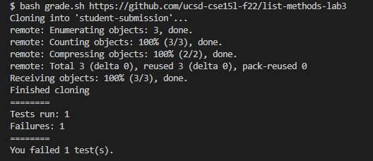

## Passing Test: T2 from L6
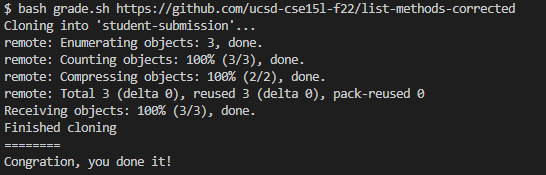

Whoopee, both work as intended! Let's run test 3 from Lab 6 though, just to be sure:

## Compile Error: T3 from L6
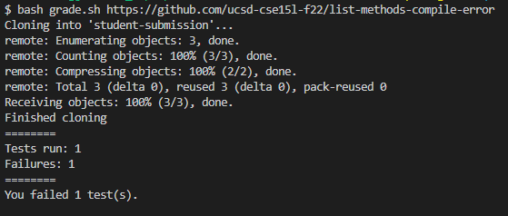

Well, huh. I guess a compile error is a kind of failure but it sure isn't clear, is it? And besides, we saved compiling information in that one text file, so we might as well use it.

After the command to compile, I'll put a conditional down. If `error-output.txt` isn't empty then I print "Failed to compile." and exit the program. Otherwise, I move on.

```
Code to be added after command to compile:

if [ -s ../error-output.txt ]
then
    echo 'Failed to compile.'
    exit 1
fi
```

## Compile Error: T3 from L6 (Fixed)
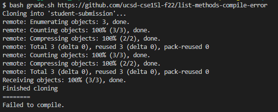

Wait though- I'm not finished just yet. Students (and professors, and professionals in industry... really, anyone who does any coding ever) do the darndest things sometimes, and that includes misnaming files. So let's check that the proper file is in the submission repo before grading anything.

The file I'm looking for is `ListExamples.java`. It may be different for you. After `cd`ing into `student-submission`, I'll implement a check for being able to find the `.java` file. If it's found, I print "Found file to be graded!". Otherwise, I print "Need file ListExamples.java" and exit the program.

```
Code to be added after cd-ing into student-submission:

if [ -f ListExamples.java ]
then
    echo 'Found file to be graded!'
else
    echo 'Need file ListExamples.java'
    exit 1
fi
```

## Misnamed File: T5 from L6
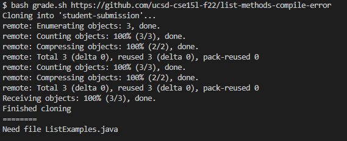

## Wrong Directory: T6 from L6
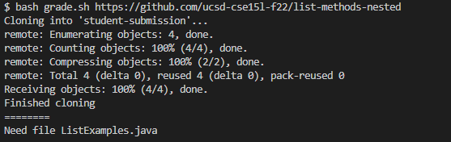

# Final Code In grade.sh

```
CPATH='.;../lib/hamcrest-core-1.3.jar;../lib/junit-4.13.2.jar'

rm -rf student-submission
git clone $1 student-submission
echo 'Finished cloning'
echo ========

cp TestListExamples.java student-submission/
cd student-submission

if [ -f ListExamples.java ]
then
    echo 'Found file to be graded!'
else
    echo 'Need file ListExamples.java'
    exit 1
fi

javac -cp $CPATH *.java 2> ../error-output.txt

if [ -s ../error-output.txt ]
then
    echo 'Failed to compile.'
    exit 1
fi

java -cp $CPATH org.junit.runner.JUnitCore TestListExamples > ../output.txt

cd ..
TESTREPORT=`grep "Tests run: " output.txt`

IFS="," read -a REPORT_ARR <<< $TESTREPORT

FAILURES=(${REPORT_ARR[1]})

if [ -z $FAILURES ] || [ ${FAILURES[1]} -eq 0 ]
then
    echo 'Congration, you done it!'
else
    echo ${REPORT_ARR[0]}
    echo ${REPORT_ARR[1]}
    echo ========
    echo 'You failed ${FAILURES[1]} test(s).'
fi
```

# Those That Were Left Behind

I actually wasn't able to implement ways to cover for Tests 4 and 7 in Lab 6. Here are the results if you are interested in them, regardless.

## Doesn't match expected behavior: T4 from L6
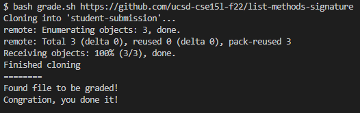

## CHALLENGE - Subtle Bugs: T7 from L6
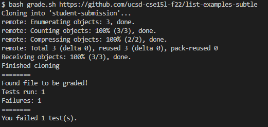

# Closing Remarks

This quarter went by way faster than I thought it would've. Being faced with finals is still a little daunting since it's my first year here but I'm glad for my time in this class, at least. The labs have been great (I just wish they weren't so far away for being as long as they are!) and writing these lab reports has been oddly therapeutic. I'm crossing my fingers for the upcoming Skill Demo; if I get that, I should have 15L in the bag.